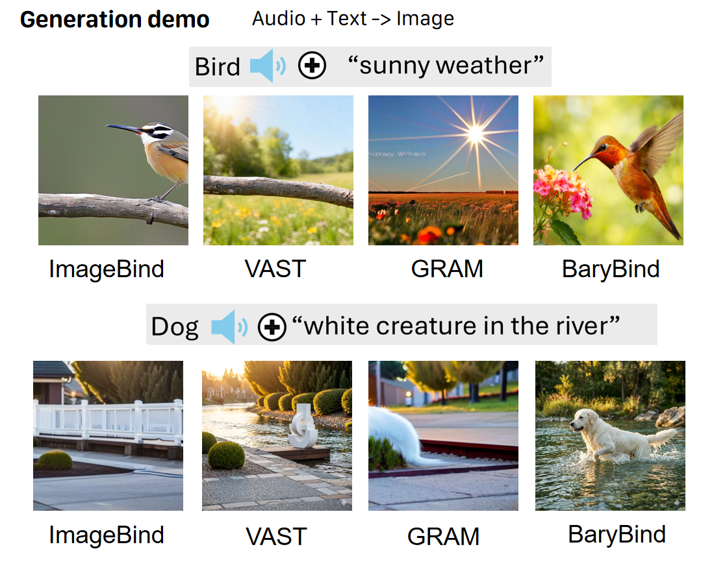

### Text+Auido to Image Generation Demo




###  Multimodal alignement unlock new and fancy downstream task

An aligned shared latent space among n modalities is a strong baseline for whatever downstream task that rely on embedding extraction. The results obtained from this paper will lead to superior performance in existing downstream tasks (T2I, T2V, V2A, etc.) but also unlock fancy tasks such as for example image to audio generation or image generation conditioned on text and audio.


## Building Environment
BaryBind is implemented based on Pytorch. We use Python-3.9 and Cuda-11.7. Other version could be also compatible. Other needed packages are listed in preinstall.sh.

```
conda create -n barybind python=3.9
conda activate barybind
sh preinstall.sh
```

## Download basic encoder's pretrained checkpoints
Make a dir named pretrained_weights under the main work dir.

1. Download evaclip weight:
```
wget -P pretrained_weights/clip/ https://huggingface.co/QuanSun/EVA-CLIP/resolve/main/EVA01_CLIP_g_14_psz14_s11B.pt
```
2. Download beats weight from https://github.com/microsoft/unilm/tree/master/beats

3. Download bert weight:
```python
from transformers import BertModel, BertTokenizer
bert = BertModel.from_pretrained('bert-base-uncased')
bert_tokenizer = BertTokenizer.from_pretrained('bert-base-uncased')
bert.save_pretrained('pretrained_weights/bert/bert-base-uncased')
bert_tokenizer.save_pretrained('pretrained_weights/bert/bert-base-uncased')
```


The processed  pretrained_weights path should be as follows:
```
    ├── pretrained_weights
    │   ├── beats
    │   │   └── BEATs_iter3_plus_AS2M.pt
    │   ├── bert
    │   │   └── bert-base-uncased
    │   ├── clip
    │   │   └── EVA01_CLIP_g_14_psz14_s11B.pt
```

## MODEL ZOO


Download the entire folder that consists of a subfolder "log" and another one "ckpt. Place the folder whatever you prefer and record the location for future commands.

An example of paths after the download could be as follow:

```
    ├── pretrained_models
    │   ├── barybind_pretrained_4modalities
    │   │   ├── log
    │   │   ├── ckpt    

```


## Download  VAST-27M annotations for pretraining

VAST-27M DATASET could be downloaded following the official [repo](https://github.com/TXH-mercury/VAST)

We used a subset of VAST-27M for the pretraining phase of BaryBind. This is the annotation file used [here](https://drive.google.com/file/d/1s_YMQirx4MalnC_dw7h-NVY2KkTimCrC/view?usp=sharing)

## Finetune  Model on the 150k subset of VAST27M
Download annotations150k.json file subset.
Reference it in scripts/barybind/finetune_ret.sh and in config/barybind/finetune_cfg/finetune-area.json
```
sh scripts/barybind/finetune_ret.sh
```


## Finetune  Model on downstream datasets
Change configuration internally at scripts/barybind/finetune_ret.sh and then run

```
sh scripts/barybind/finetune_ret.sh
```


## Test your finetuned Model
For example, if the cmd for finetuning retrieval model is as follows:

```
python3 -m torch.distributed.launch \
--nnodes 1 \
--node_rank 0 \
--nproc_per_node 8 \
--master_port 9834 \
./run.py \
--learning_rate 2e-5 \
--checkpointing true \
--first_eval true \
--save_best true \
--config ./config/barybind/finetune_cfg/retrieval-msrvtt.json \
--pretrain_dir $PATH-TO-CKPT-FOLDER \
--output_dir $PATH-WHERE-TO-STORE-RESULTS \
```

if you want to test model, just add following two rows to the cmd:
```
--mode 'testing' \
--checkpoint /PATH/TO/SAVED_CHECKPOINT.pt
```

